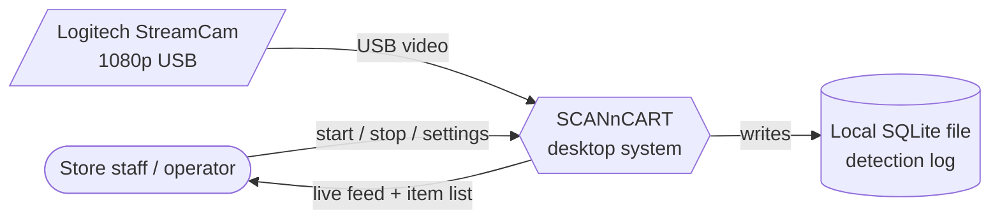
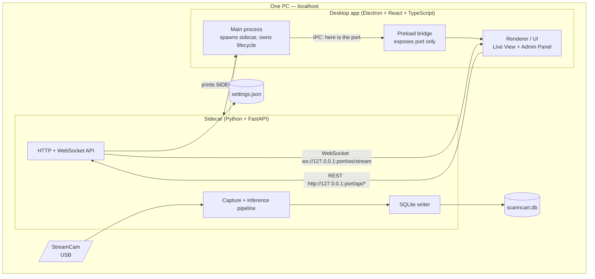
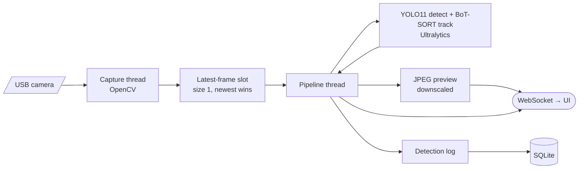
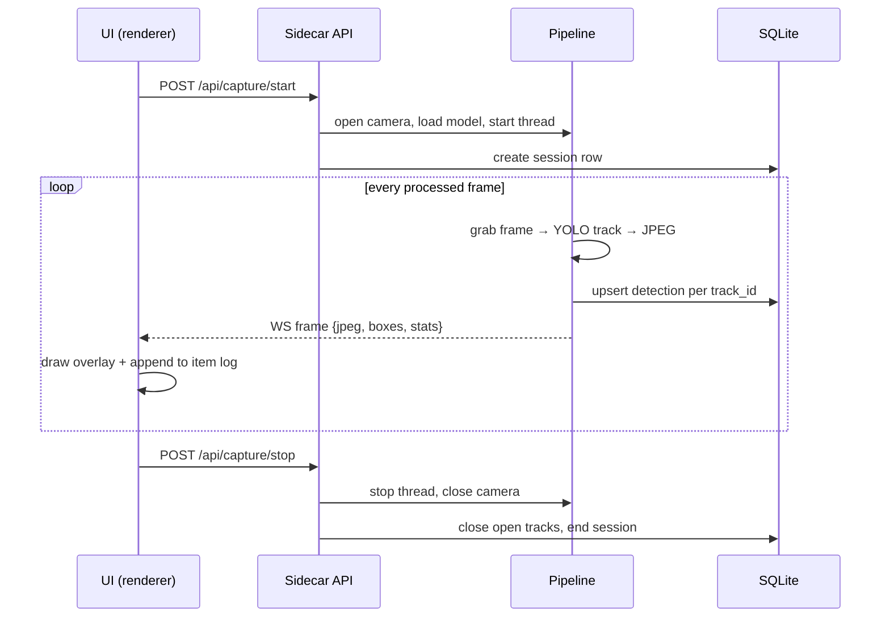

# SCANnCART — System Architecture (Low Fidelity)

> Level of detail: boxes and arrows. Enough to explain the system to a reviewer
> without reading code. For the product spec see [PRD.md](./PRD.md); for
> out-of-scope future work see [DEPLOYMENT.md](./DEPLOYMENT.md).

---

## 1. Context — what the system is

Everything runs on **one PC**. No server, no cloud, no network dependency.



ASCII equivalent:

```
  [ Operator ]                  [ Logitech StreamCam ]
       |  start/stop                     |  USB
       v  settings                       v
  +------------------------------------------------+
  |             SCANnCART  (one PC)                |
  +------------------------------------------------+
       |                                   |
       v  live feed + item log             v  writes
  [ Operator ]                        [ SQLite file ]
```

---

## 2. Containers — the two processes

The system is **two independent processes** that talk over **localhost only**.



**Key idea:** Electron IPC is used for *one thing only* — telling the UI which
port the sidecar landed on. All real traffic goes straight from the renderer to
`127.0.0.1:<port>`.

```
 Electron main ──spawn──► Python sidecar
       ▲                        │
       └──── "SIDECAR_PORT=n" ──┘        (stdout handshake)
       │
       └──IPC──► preload ──► renderer ──REST/WS──► sidecar
```

---

## 3. Sidecar internals — the processing chain



Two threads, one hand-off point:

```
  camera thread          [ 1-frame buffer ]          pipeline thread
  grab frame  ──────────►  newest wins    ──────────►  YOLO11 detect
  (OpenCV, USB)           (no queue,                     └► BoT-SORT track
                           no backlog)                       └► encode → log → push
```

The size-1 buffer is the backpressure strategy: if inference is slower than
capture, old frames are simply dropped rather than queued, so the preview stays
live instead of drifting behind.

### 3.1 The AI model, low fidelity

Two algorithms run per frame, not one:

```
  frame ──► DETECT                     ──► TRACK                      ──► detections
            YOLO11 (Ultralytics)           BoT-SORT                       + stable
            what is it + where             which box is which             track_id
            → class, confidence, box       object across frames
```

| | Choice | Note |
|---|---|---|
| Detector | YOLO11, Ultralytics/PyTorch | Size tier is **configurable**, not hardcoded: `n` / `s` / `m` / `l` / `x`, selected by hardware preset. Default `yolo11n`. |
| Tracker | BoT-SORT | Ultralytics' default — the code calls `.track(persist=True)` without a `tracker=` argument. ByteTrack would require opting in explicitly. |

**Why the tracker is architecturally load-bearing:** detection alone would emit
the same item once per frame. The tracker's `track_id` is what collapses that
into *one row per physical item* in the log — it is the reason the item list
counts items instead of frames, and the reason `entered_at` / `left_at` exist.

---

## 4. Runtime flow — one capture session



**Detection → item log rule (low fidelity):** each tracked object gets a stable
`track_id`. One `track_id` = one row in the item log, not one row per frame. A
track that stops being seen for a short expiry window is marked as "left".

---

## 5. Interfaces — the contract surface

```
  UI ──────► sidecar     REST  (control plane, request/response)
      health · settings get/patch · system-info · presets ·
      capture start/stop · logs

  UI ◄────── sidecar     WebSocket  (data plane, push)
      frame messages   : jpeg + detections + fps/latency stats
      status messages  : running / stopped / error
```

Split rationale: continuous ~30fps streaming is push (WebSocket); everything
occasional is pull (REST). No per-frame HTTP requests.

---

## 6. Data model — low fidelity

```
  sessions                        detection_events
  ─────────                       ────────────────
  id                  1 ────────► session_id
  started_at          n           track_id
  ended_at                        class_name
  model_name                      confidence / max_conf
  device                          entered_at
                                  left_at   (NULL while still in frame)
```

One row per capture cycle in `sessions`; one row per tracked item per session in
`detection_events`.

---

## 7. Configuration & lifecycle

```
  settings.json ──load at startup──► Settings ──► pipeline

  Change a setting while capture is RUNNING:
      hot-reloadable  ─► applies immediately (preview size, frame skip, expiry)
      restart-required ─► rejected; must stop capture first
                          (model, device, camera params, threshold)
```

```
  App launch                       App quit
  ──────────                       ────────
  Electron ready                   before-quit
     └─ spawn sidecar                 └─ stop capture
        └─ read port                     └─ kill sidecar child
           └─ UI connects (auto-retry)       └─ close DB
```

The UI tolerates the sidecar not being up yet: the WebSocket client auto-
reconnects, and on reconnect while capture is running it re-seeds the item log
from the logs endpoint rather than losing session state.

---

## 8. Design decisions, one line each

| Decision | Why |
|---|---|
| Two processes, not one | Ultralytics/YOLO is Python-only; keeps heavy CV work out of the Node/Electron process. |
| localhost HTTP + WS | Simple, debuggable, no network dependency; matches the future dashboard shape. |
| Port printed on stdout | Avoids a fixed-port collision; sidecar picks a free port and tells the parent. |
| Size-1 frame buffer | Drops stale frames instead of building a queue — bounded latency. |
| Track-id deduping (BoT-SORT) | Item log is a list of *items*, not a list of *frames*. |
| SQLite, single writer | Zero-config local store; one connection under a lock keeps two threads safe. |
| Dependency injection everywhere | Whole pipeline is testable against fakes — no camera, GPU, or network in tests. |

---

## 9. Boundaries — what this architecture deliberately excludes

Not present, by design (see [DEPLOYMENT.md](./DEPLOYMENT.md)):
centralized/server inference · edge hardware (ESP32-CAM, Pi, Jetson) ·
weight sensors · cloud sync and analytics · mobile control app · containers.
