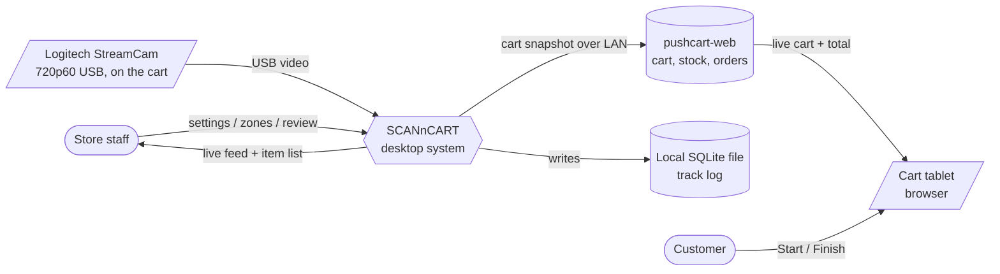
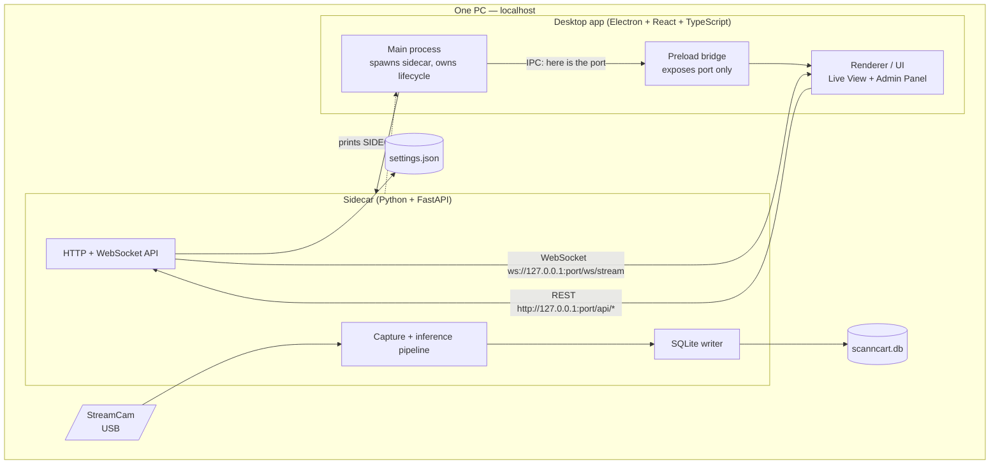
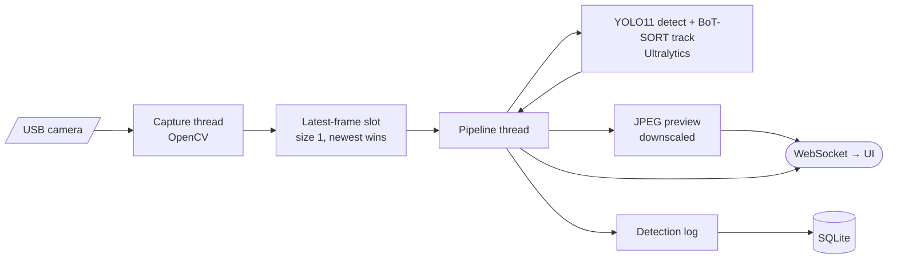
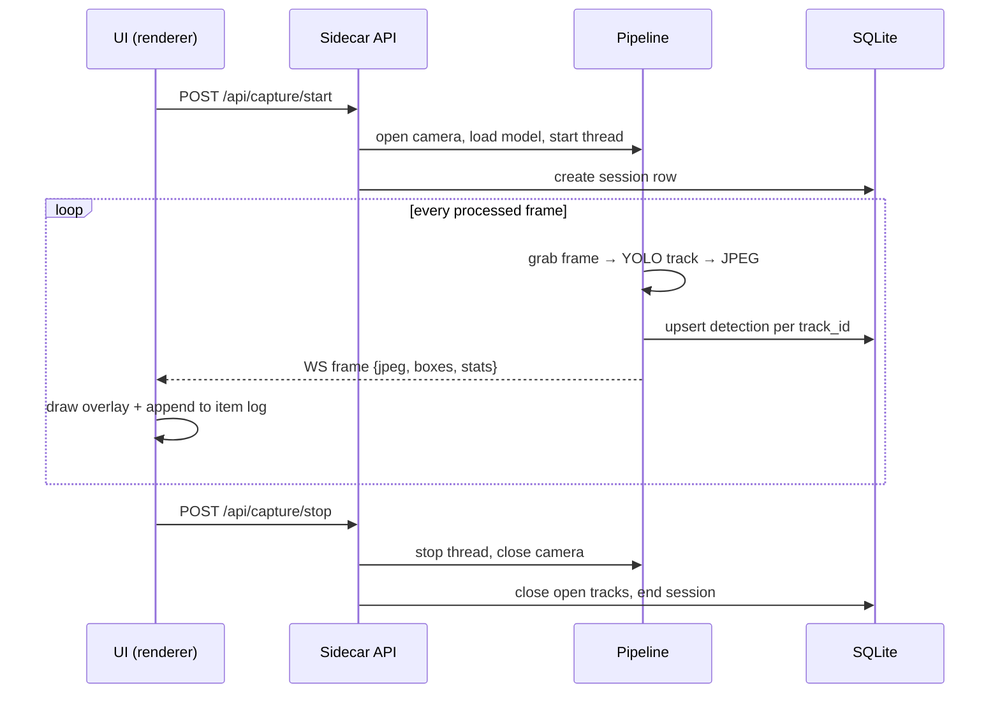
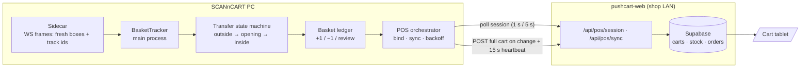

# SCANnCART — System Architecture (Low Fidelity)

> Level of detail: boxes and arrows. Enough to explain the system to a reviewer
> without reading code. For the product spec see [PRD.md](./PRD.md); for
> out-of-scope future work see [DEPLOYMENT.md](./DEPLOYMENT.md).

---

## 1. Context — what the system is

Detection runs on **one PC** with no internet dependency. The one network hop is the
self-checkout integration: the PC tells **pushcart-web** (the store's checkout, hosted on the shop
LAN) what is in the customer's basket, and the customer's tablet shows it (§10).


```mermaid
flowchart LR
    U([Store staff])
    K([Customer])
    C[/Logitech StreamCam\n720p60 USB, on the cart/]
    S{{SCANnCART\ndesktop system}}
    D[(Local SQLite file\ntrack log)]
    W[(pushcart-web\ncart, stock, orders)]
    T[/Cart tablet\nbrowser/]

    C -- USB video --> S
    U -- settings / zones / review --> S
    S -- live feed + item list --> U
    S -- writes --> D
    S -- cart snapshot over LAN --> W
    W -- live cart + total --> T
    K -- Start / Finish --> T
```

ASCII equivalent:

```
  [ Operator ]                  [ Logitech StreamCam ]
       |  start/stop                     |  USB
       v  settings                       v
  +------------------------------------------------+
  |             SCANnCART  (one PC)                |
  +------------------------------------------------+
       |                                   |
       v  live feed + item log             v  writes
  [ Operator ]                        [ SQLite file ]
```

---

## 2. Containers — the two processes

The system is **two independent processes** that talk over **localhost only**.


```mermaid
flowchart TB
    subgraph PC["One PC — localhost"]
        subgraph EL["Desktop app  (Electron + React + TypeScript)"]
            MAIN["Main process\nspawns sidecar, owns lifecycle"]
            PRE["Preload bridge\nexposes port only"]
            REN["Renderer / UI\nLive View + Admin Panel"]
        end

        subgraph SC["Sidecar  (Python + FastAPI)"]
            API["HTTP + WebSocket API"]
            PIPE["Capture + inference pipeline"]
            STORE["SQLite writer"]
        end

        CAM[/StreamCam\nUSB/]
        DB[(scanncart.db)]
        CFG[(settings.json)]
    end

    MAIN -- "spawn child process" --> SC
    SC -. "prints SIDECAR_PORT=n" .-> MAIN
    MAIN -- "IPC: here is the port" --> PRE --> REN
    REN -- "REST  http://127.0.0.1:port/api/*" --> API
    API -- "WebSocket  ws://127.0.0.1:port/ws/stream" --> REN
    CAM --> PIPE
    PIPE --> STORE --> DB
    API --> CFG
```

**Key idea:** Electron IPC is used for *one thing only* — telling the UI which
port the sidecar landed on. All real traffic goes straight from the renderer to
`127.0.0.1:<port>`.

```
 Electron main ──spawn──► Python sidecar
       ▲                        │
       └──── "SIDECAR_PORT=n" ──┘        (stdout handshake)
       │
       └──IPC──► preload ──► renderer ──REST/WS──► sidecar
```

---

## 3. Sidecar internals — the processing chain


```mermaid
flowchart LR
    CAM[/USB camera/] --> CAP["Capture thread\nOpenCV"]
    CAP --> BUF["Latest-frame slot\nsize 1, newest wins"]
    BUF --> PIPE["Pipeline thread"]
    PIPE --> INF["YOLO11 detect + BoT-SORT track\nUltralytics"]
    INF --> PIPE
    PIPE --> JPG["JPEG preview\ndownscaled"]
    PIPE --> LOG["Detection log"]
    JPG --> WS(["WebSocket → UI"])
    PIPE --> WS
    LOG --> DB[(SQLite)]
```

Two threads, one hand-off point:

```
  camera thread          [ 1-frame buffer ]          pipeline thread
  grab frame  ──────────►  newest wins    ──────────►  YOLO11 detect
  (OpenCV, USB)           (no queue,                     └► BoT-SORT track
                           no backlog)                       └► encode → log → push
```

The size-1 buffer is the backpressure strategy: if inference is slower than
capture, old frames are simply dropped rather than queued, so the preview stays
live instead of drifting behind.

### 3.1 The AI model, low fidelity

Two algorithms run per frame, not one:

```
  frame ──► DETECT                     ──► TRACK                      ──► detections
            YOLO11 (Ultralytics)           BoT-SORT                       + stable
            what is it + where             which box is which             track_id
            → class, confidence, box       object across frames
```

| | Choice | Note |
|---|---|---|
| Detector | YOLO11, Ultralytics/PyTorch | The shipped weight is `models/scanncart-grocery-v1.pt`: YOLO11s fine-tuned on the 7 store SKUs (the default). Stock COCO tiers `n`…`x` stay selectable for comparison. |
| Tracker | BoT-SORT | Ultralytics' default — the code calls `.track(persist=True)` without a `tracker=` argument. ByteTrack would require opting in explicitly. |

**Why the tracker is architecturally load-bearing:** detection alone would emit
the same item once per frame. The tracker's `track_id` is what collapses that
into *one row per physical item* in the log — it is the reason the item list
counts items instead of frames, and the reason `entered_at` / `left_at` exist.

---

## 4. Runtime flow — one capture session


```mermaid
sequenceDiagram
    participant UI as UI (renderer)
    participant API as Sidecar API
    participant P as Pipeline
    participant DB as SQLite

    UI->>API: POST /api/capture/start
    API->>P: open camera, load model, start thread
    API->>DB: create session row
    loop every processed frame
        P->>P: grab frame → YOLO track → JPEG
        P->>DB: upsert detection per track_id
        P-->>UI: WS frame {jpeg, boxes, stats}
        UI->>UI: draw overlay + append to item log
    end
    UI->>API: POST /api/capture/stop
    API->>P: stop thread, close camera
    API->>DB: close open tracks, end session
```

**Detection → item log rule (low fidelity):** each tracked object gets a stable
`track_id`. One `track_id` = one row in the item log, not one row per frame. A
track that stops being seen for a short expiry window is marked as "left".

---

## 5. Interfaces — the contract surface

```
  UI ──────► sidecar     REST  (control plane, request/response)
      health · settings get/patch · system-info · presets ·
      capture start/stop · logs · dataset status (a local file read, no network;
      labeling progress + the Tier A capture gap + the capture-session split spread)

  UI ◄────── sidecar     WebSocket  (data plane, push)
      frame messages   : jpeg + detections + fps/latency stats
      status messages  : running / stopped / error
```

Split rationale: continuous ~30fps streaming is push (WebSocket); everything
occasional is pull (REST). No per-frame HTTP requests.

---

## 6. Data model — low fidelity

```
  sessions                        detection_events
  ─────────                       ────────────────
  id                  1 ────────► session_id
  started_at          n           track_id
  ended_at                        class_name
  model_name                      confidence / max_conf
  device                          entered_at
                                  left_at   (NULL while still in frame)
```

One row per capture cycle in `sessions`; one row per tracked item per session in
`detection_events`.

---

## 7. Configuration & lifecycle

```
  settings.json ──load at startup──► Settings ──► pipeline

  Change a setting while capture is RUNNING:
      hot-reloadable  ─► applies immediately (preview size, frame skip, expiry,
                          confidence threshold, filters, camera controls, auto exposure)
      restart-required ─► rejected; must stop capture first
                          (model, device, camera index/resolution/fps, backend)
```

```
  App launch                       App quit
  ──────────                       ────────
  Electron ready                   before-quit
     └─ spawn sidecar                 └─ stop capture
        └─ read port                     └─ kill sidecar child
           └─ UI connects (auto-retry)       └─ close DB
```

The UI tolerates the sidecar not being up yet: the WebSocket client auto-
reconnects, and on reconnect while capture is running it re-seeds the item log
from the logs endpoint rather than losing session state.

---

## 8. Design decisions, one line each

| Decision | Why |
|---|---|
| Two processes, not one | Ultralytics/YOLO is Python-only; keeps heavy CV work out of the Node/Electron process. |
| localhost HTTP + WS | Simple, debuggable, no network dependency; matches the future dashboard shape. |
| Port printed on stdout | Avoids a fixed-port collision; sidecar picks a free port and tells the parent. |
| Size-1 frame buffer | Drops stale frames instead of building a queue — bounded latency. |
| Track-id deduping (BoT-SORT) | Item log is a list of *items*, not a list of *frames*. |
| SQLite, single writer | Zero-config local store; one connection under a lock keeps two threads safe. |
| Dependency injection everywhere | Whole pipeline is testable against fakes — no camera, GPU, or network in tests. |
| Label progress read from a snapshot file | The tooling that talks to Roboflow stays dev-only, so the runtime keeps its "no network dependency" promise and never handles a dataset API key. |
| The capture plan travels in that snapshot too | The Tier A gap is written by the tool that owns the plan (`clean_v2.TIER_A_CELLS`, the same table `scaffold` builds folders from) rather than retyped into the sidecar, so the panel cannot point at cells the folder skeleton does not create. |
| Capture gap and labeling progress are separate sections | A cell with zero images is waiting for the *camera*, not for a box. Shown as one "0% labeled" number, an unshot cell reads as a labeling backlog — the reading that wastes a capture session. |
| The snapshot carries the capture-session spread | Which split each session's frames went to decides whether an accuracy number may be called an *unseen-session* estimate or only held-out frames. The session is read from the image tags (the hard negatives are absent from the roster manifest), and the split count is *derived* by the sidecar from the three counts the panel renders, so the flag cannot disagree with the numbers beside it. |
| The session is flagged only when it sits in both train and test | A session spread across train and valid is the ordinary remainder split: it costs model *selection* some independence, which is a much smaller problem than a test set drawn from the training session. Flagging both would make the warning fire on a state that does not spoil the number. |

---

## 9. Boundaries — what this architecture deliberately excludes

Not present, by design (see [DEPLOYMENT.md](./DEPLOYMENT.md)):
centralized/server inference · edge hardware (ESP32-CAM, Pi, Jetson) ·
weight sensors · cloud sync and analytics · mobile control app · payment capture.

---

## 10. Self-checkout and the basket ledger

The desktop's **main process** (not the renderer) runs the self-checkout loop, because the renderer
cannot reach pushcart-web and the shared secret must not travel into a page.


```mermaid
flowchart LR
    subgraph PC["SCANnCART PC"]
        SC["Sidecar\nWS frames: fresh boxes + track ids"]
        BT["BasketTracker\nmain process"]
        SM["Transfer state machine\noutside → opening → inside"]
        LG["Basket ledger\n+1 / −1 / review"]
        OR["POS orchestrator\nbind · sync · backoff"]
    end
    subgraph WEB["pushcart-web (shop LAN)"]
        API["/api/pos/session · /api/pos/sync"]
        DB[("Supabase\ncarts · stock · orders")]
    end
    TAB[/"Cart tablet"/]

    SC --> BT --> SM --> LG --> OR
    OR -- "poll session (1 s / 5 s)" --> API
    OR -- "POST full cart on change + 15 s heartbeat" --> API
    API --> DB --> TAB
```

| Piece | Rule |
| --- | --- |
| Evidence | Only *fresh* (newly analysed), *tracked* detections at or above the scanner's own confidence threshold count. |
| Deposit / removal | ≥ 2 sightings at the origin, a sighting in the opening, ≥ 2 at the destination, then a 0.4 s hold there. |
| Fast hands | A new track id of the same product within 0.6 s and 400 units of a lost one continues its path; it never takes over an item still in view. |
| Review | Ambiguity (product change, jump, two items crossing within 0.5 s, lost > 5 s, no origin, a removal of what is not held, a non-empty basket at Start, camera blind) holds the bill and blocks Finish until staff press **Basket checked**. |
| Sync | The whole cart is posted as desired state; `pos_reconcile` makes the rows match, so a repeat never duplicates. `409` ends the session; other failures back off up to 30 s. |
| Modes | `basket` posts the ledger; `counter` posts what is visible (3 s to add, 10 s to drop) and keeps the ledger as a shadow. The basket is the product. |

Details: [POS_INTEGRATION.md](./POS_INTEGRATION.md) (setup and operation) and
[CART_TRANSFER_SPEC.md](./CART_TRANSFER_SPEC.md) (the transfer rules and their acceptance gates).
